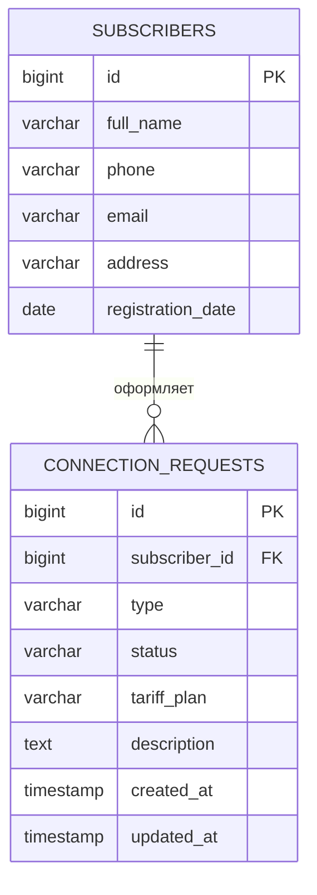

# ER-диаграмма базы данных

```mermaid
erDiagram
    SUBSCRIBERS ||--o{ CONNECTION_REQUESTS : "оформляет"

    SUBSCRIBERS {
        bigint id PK
        varchar full_name
        varchar phone
        varchar email
        varchar address
        date registration_date
    }

    CONNECTION_REQUESTS {
        bigint id PK
        bigint subscriber_id FK
        varchar type
        varchar status
        varchar tariff_plan
        text description
        timestamp created_at
        timestamp updated_at
    }
```
